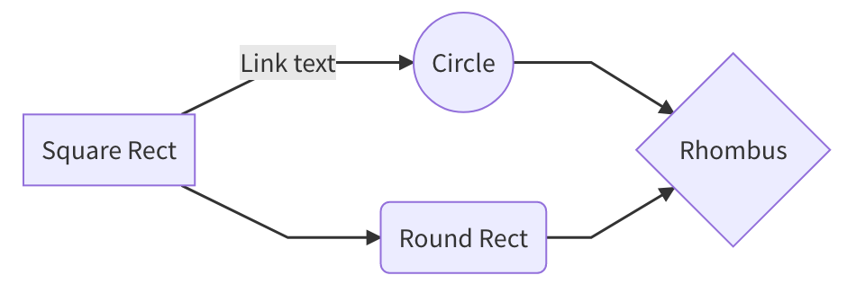
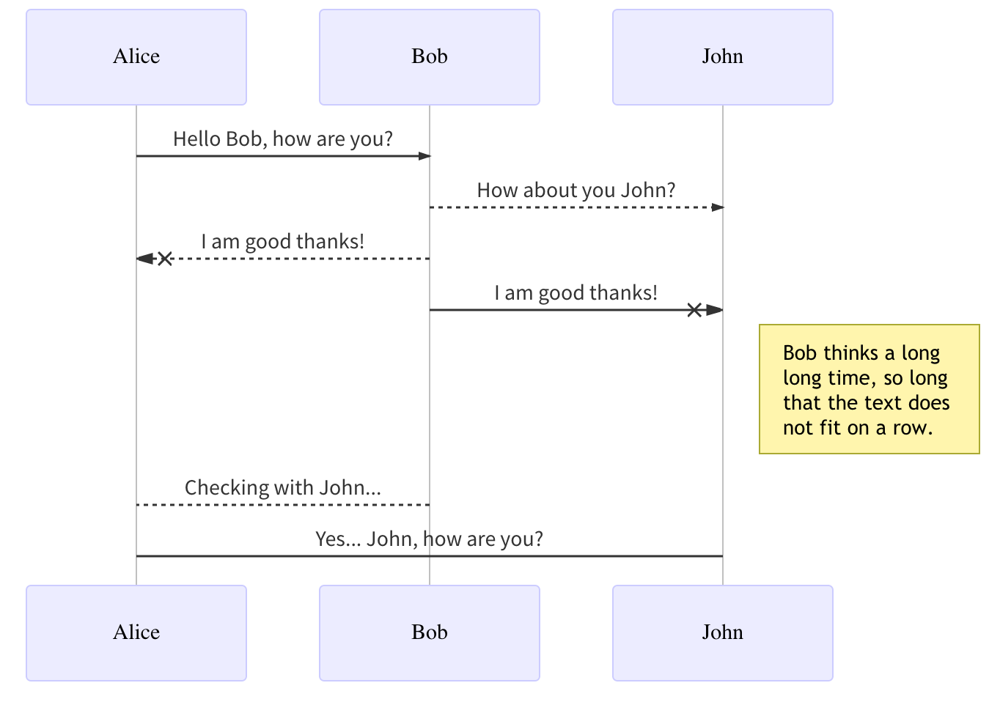
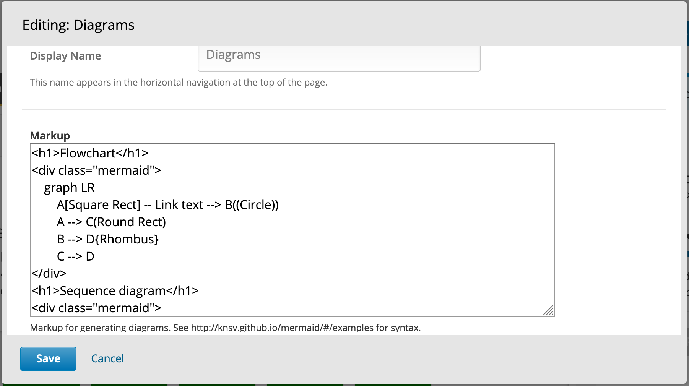

# Diagrams XBlock
XBlock for generating diagrams from text. The text is simple markdown-like script language. 
This is a simple wrapper around mermaid (https://github.com/knsv/mermaid)

## Examples

### Flowchart

```html
graph LR
    A[Square Rect] -- Link text --> B((Circle))
    A --> C(Round Rect)
    B --> D{Rhombus}
    C --> D
```



### Sequence diagram

```
sequenceDiagram
    Alice ->> Bob: Hello Bob, how are you?
    Bob-->>John: How about you John?
    Bob--x Alice: I am good thanks!
    Bob-x John: I am good thanks!
    Note right of John: Bob thinks a long<br/>long time, so long<br/>that the text does<br/>not fit on a row.

    Bob-->Alice: Checking with John...
    Alice->John: Yes... John, how are you?
```



See https://mermaidjs.github.io/#/ for more examples and docs.

# Installation
Install the requirements into the python virtual environment of your `edx-platform` installation.

```bash
$ pip install -r requirements.txt
```

Enabling in Studio
------------------

You can enable the Diagrams XBlock in studio through the
advanced settings.

1. From the main page of a specific course, navigate to `Settings ->
   Advanced Settings` from the top menu.
2. Check for the `advanced_modules` policy key, and add
   `"diagrams"` to the policy value list.
3. Click the "Save changes" button.

Usage
-----

When you add the `Diagrams` component to a course in the studio,
the block is filled with the default content.
You get following two fields to edit.



#### Display Name
This name appears in the horizontal navigation at the top of the page.

#### Markup
Markup is a simple markdown-like script language that is used to generate diagrams.
for a list of supported diagrams and their syntax please see: https://mermaidjs.github.io/#/
